# Recommended Canva Templates 🎨

These templates serve as **starting points and inspiration** for the visual structure you might use to represent your mental model. Focus on the *structure and layout*, not the specific content or instructions shown in each template. You should adapt, mix, or completely reimagine any template to fit your thinking style!

To use, simply click the template to open it in Canva and customize!

---

<h2 align="center">Template Gallery</h2>

<table>
  <tr>
    <td align="center" width="25%">
      <a href="https://www.canva.com/templates/EAGtUCMOPMw/">
        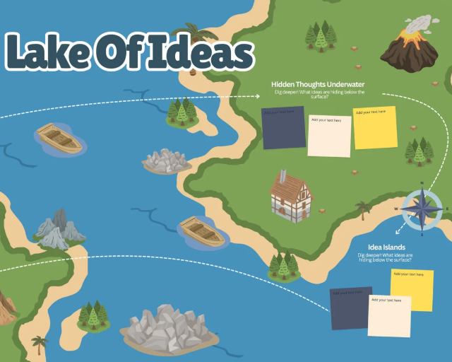
      </a>
       <strong><a href="https://www.canva.com/templates/EAGtUCMOPMw/">Lake of Ideas</a></strong>
    </td>
    <td align="center" width="25%">
      <a href="https://www.canva.com/templates/EAGtOGNK8KM/">
        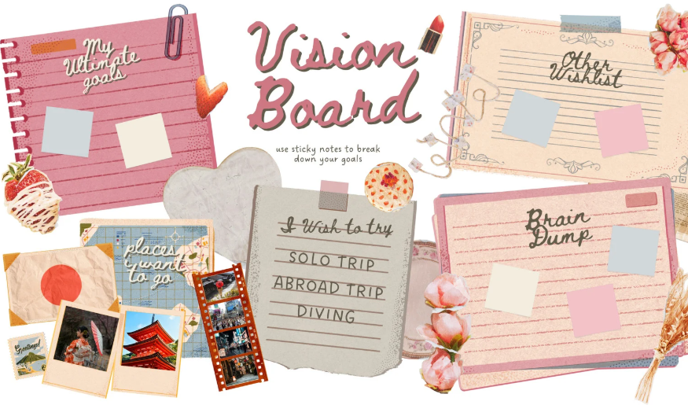
      </a>
       <strong><a href="https://www.canva.com/templates/EAGtOGNK8KM/">Vision Board (Scrapbook)</a></strong>
    </td>
    <td align="center" width="25%">
      <a href="https://www.canva.com/templates/EAGzRyuQFvQ/">
        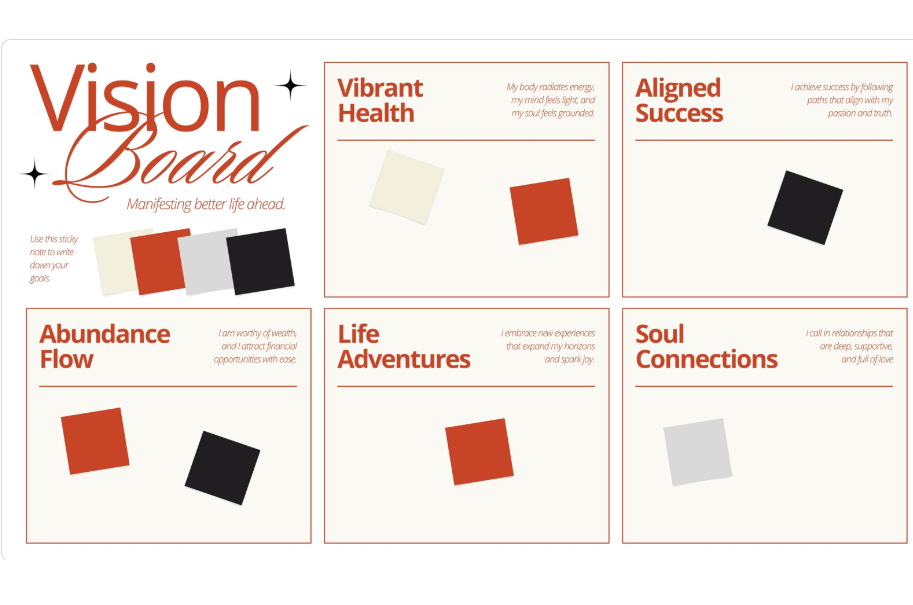
      </a>
       <strong><a href="https://www.canva.com/templates/EAGzRyuQFvQ/">Vision Board (Grid)</a></strong>
    </td>
    <td align="center" width="25%">
      <a href="https://www.canva.com/templates/EAFJY5Rv_uA/">
        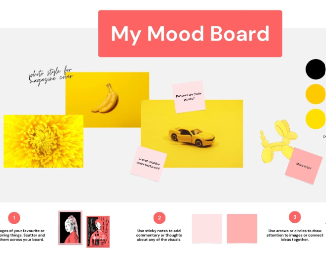
      </a>
       <strong><a href="https://www.canva.com/templates/EAFJY5Rv_uA/">Mood Board (Collage)</a></strong>
    </td>
  </tr>
  <tr>
    <td align="center" width="25%">
      <a href="https://www.canva.com/templates/EAFEZx89MSo/">
        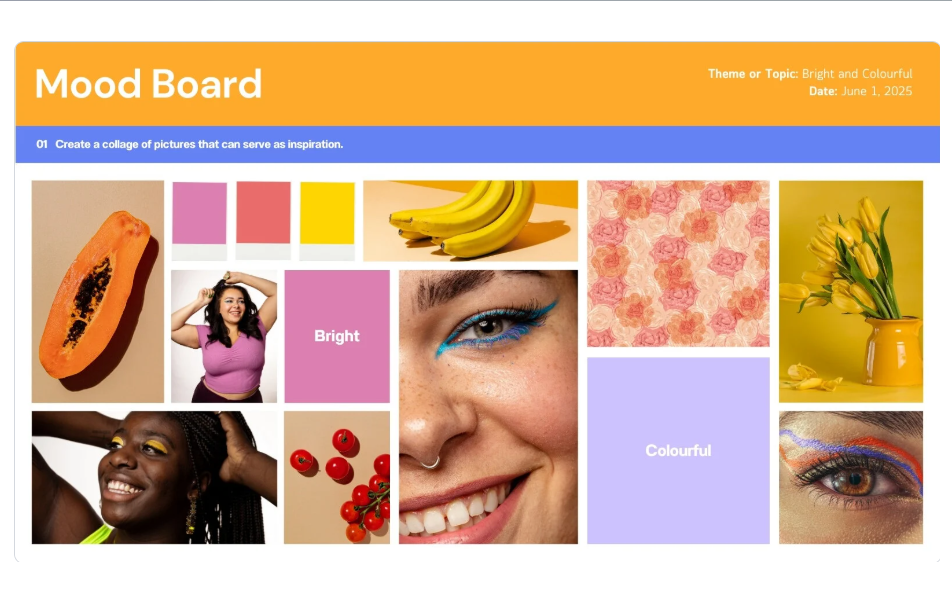
      </a>
       <strong><a href="https://www.canva.com/templates/EAFEZx89MSo/">Mood Board (Grid)</a></strong>
    </td>
    <td align="center" width="25%">
      <a href="https://www.canva.com/templates/EAFr6r4-onI/">
        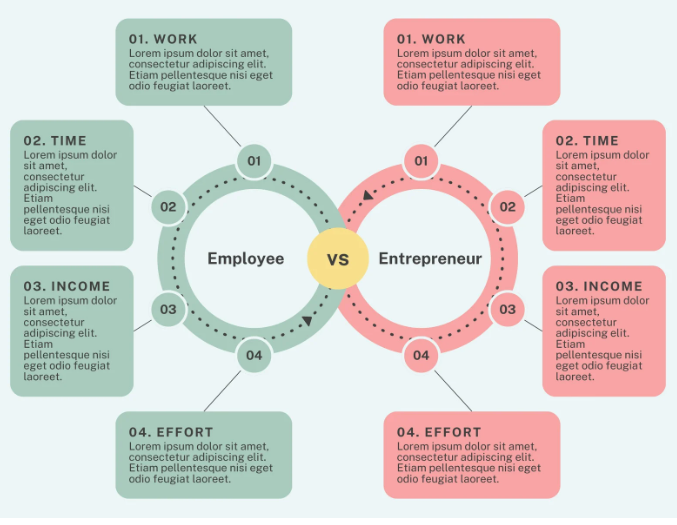
      </a>
       <strong><a href="https://www.canva.com/templates/EAFr6r4-onI/">Circle Comparison Chart</a></strong>
    </td>
    <td align="center" width="25%">
      <a href="https://www.canva.com/templates/EAGzAk3VwQg/">
        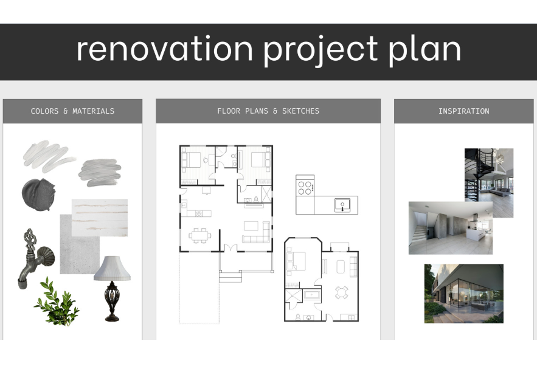
      </a>
       <strong><a href="https://www.canva.com/templates/EAGzAk3VwQg/">Project Plan</a></strong>
    </td>
    <td align="center" width="25%">
      <a href="https://www.canva.com/templates/EAGwf2aXMnw/">
        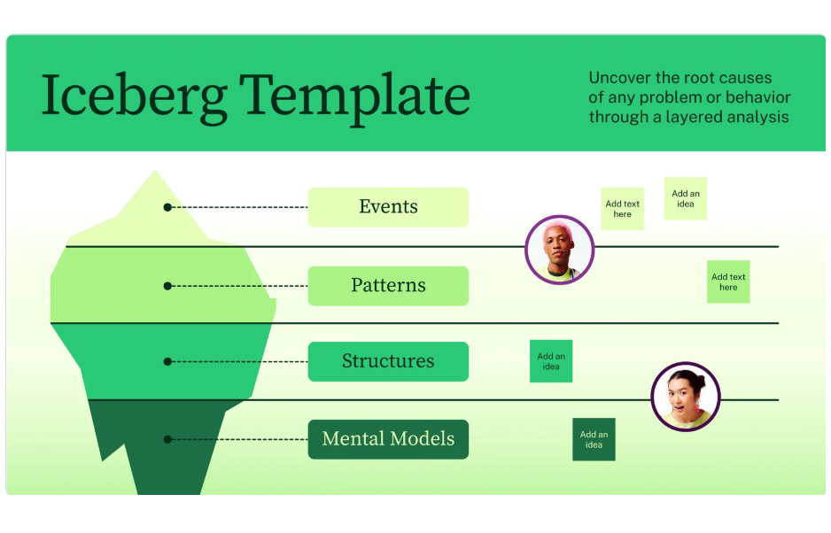
      </a>
       <strong><a href="https://www.canva.com/templates/EAGwf2aXMnw/">Iceberg Whiteboard</a></strong>
    </td>
  </tr>
  <tr>
    <td align="center" width="25%">
      <a href="https://www.canva.com/templates/EAFnnoI5a10/">
        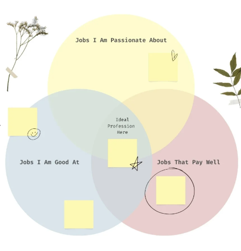
      </a>
       <strong><a href="https://www.canva.com/templates/EAFnnoI5a10/">3-Circle Venn Diagram</a></strong>
    </td>
    <td align="center" width="25%">
      <a href="https://www.canva.com/templates/EAFG1sutVVM/">
        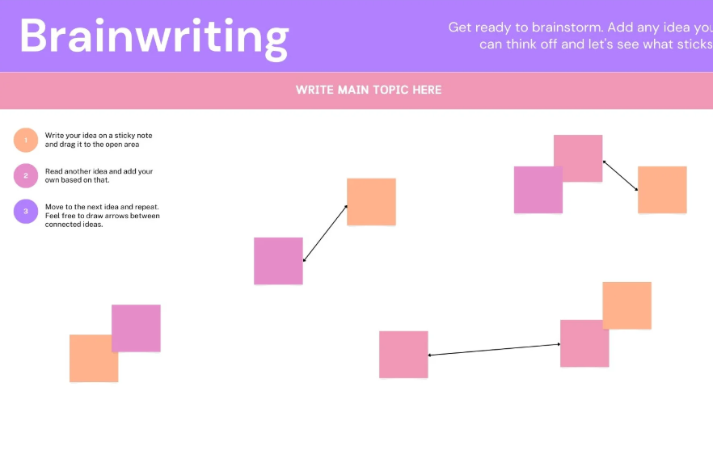
      </a>
       <strong><a href="https://www.canva.com/templates/EAFG1sutVVM/">Brain Writing Whiteboard</a></strong>
    </td>
    <td align="center" width="25%">
      <a href="https://www.canva.com/templates/EAGGBznhnPM/">
        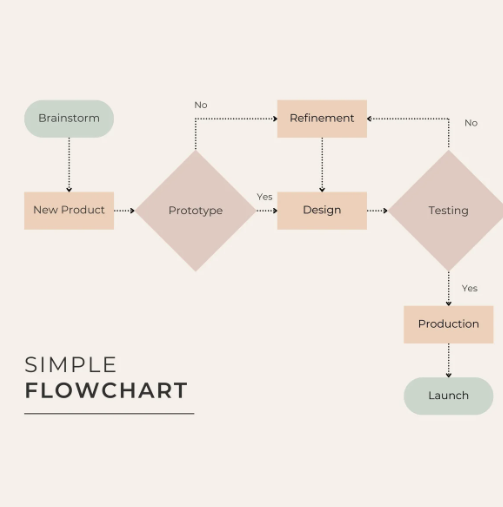
      </a>
       <strong><a href="https://www.canva.com/templates/EAGGBznhnPM/">Simple Flowchart</a></strong>
    </td>
    <td align="center" width="25%">
      <a href="https://www.canva.com/templates/EAE45W4T_yo/">
        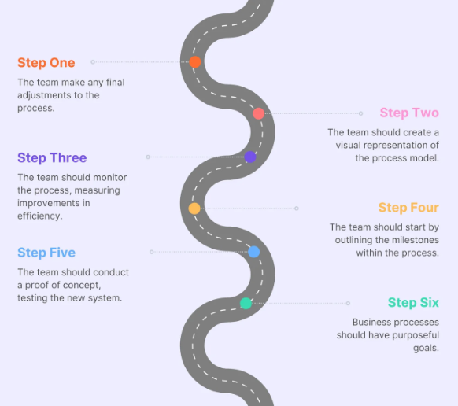
      </a>
       <strong><a href="https://www.canva.com/templates/EAE45W4T_yo/">Simple Roadmap</a></strong>
    </td>
  </tr>
</table>

---

## 💡 Tips for Using Templates

- **Don't feel constrained**: These are inspiration, not rigid requirements
- **Mix and match**: Combine elements from multiple templates
- **Adapt freely**: Change colors, shapes, and layouts to fit your concept
- **Start simple**: You can always add complexity as your model develops
- **Explore more**: Canva has thousands more templates in their [Template Library](https://www.canva.com/templates/)

---

**Remember**: The goal is to visualize *your* thinking process. Use these templates as scaffolding, then make them your own!
