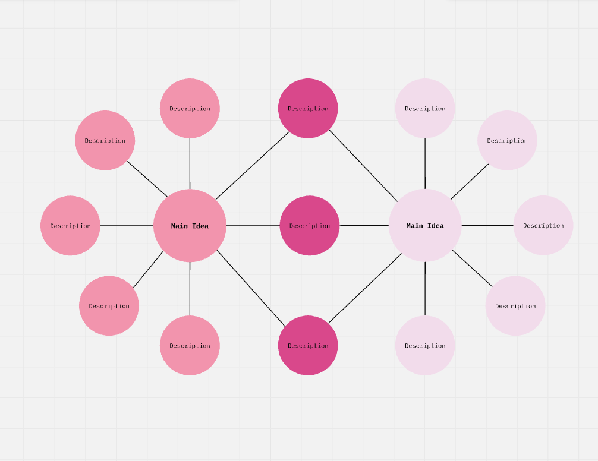
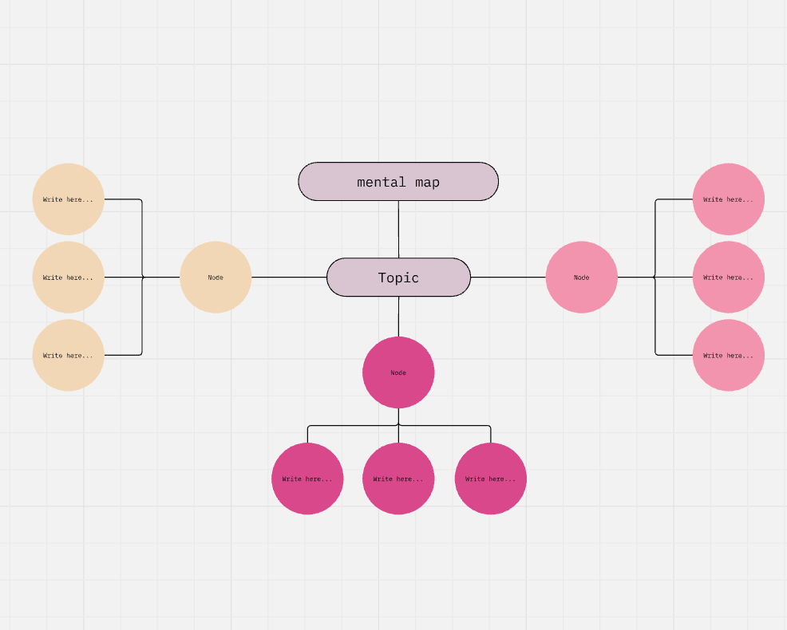
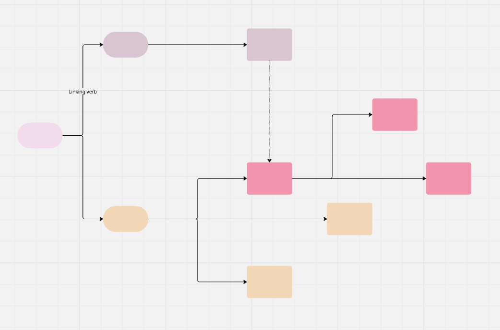
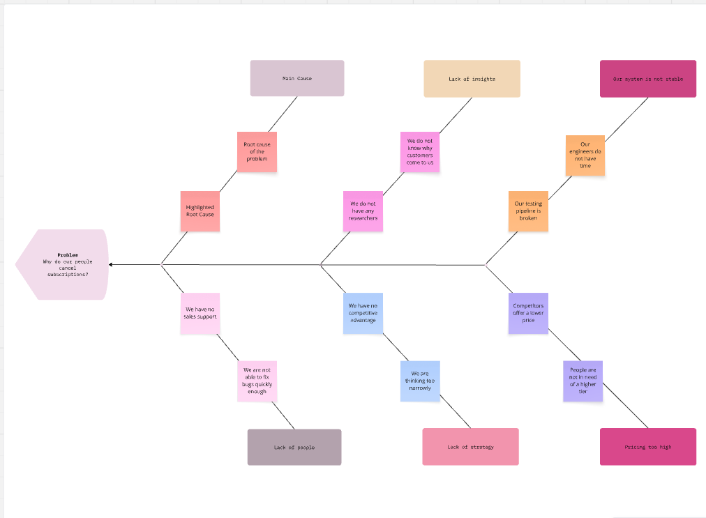
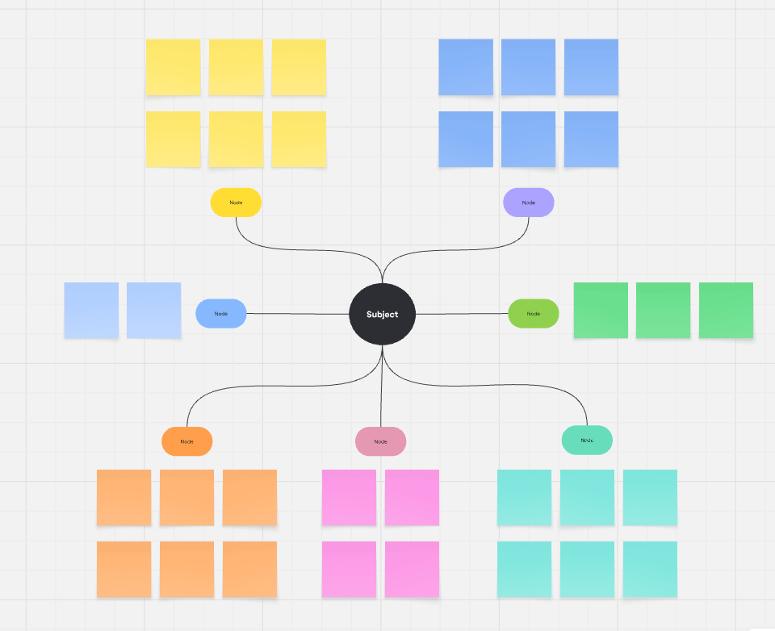
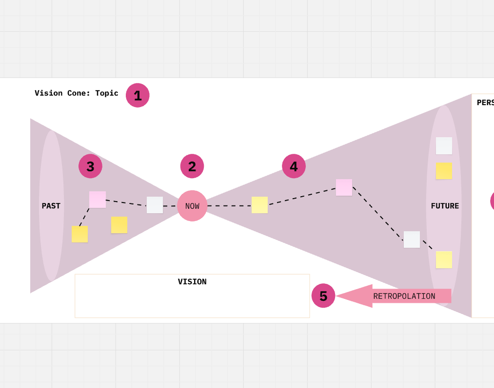
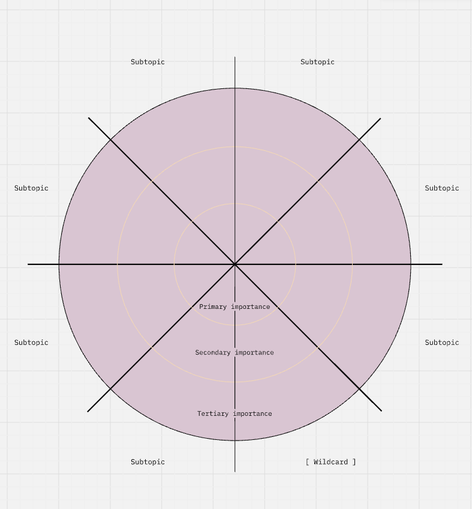
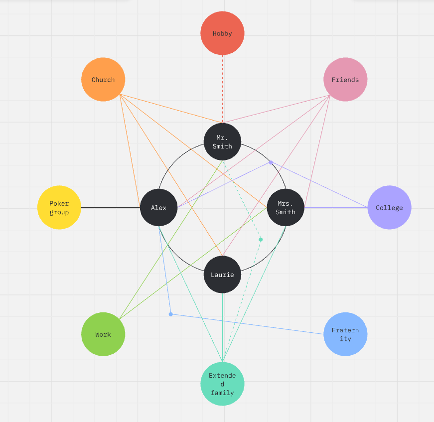

# Recommended Miro Templates 🧩

These templates serve as **starting points and inspiration** for the visual structure you might use to represent your mental model. Focus on the *structure and layout*, not the specific content or instructions shown in each template. Feel free to adapt, mix, or completely reimagine any template to fit your thinking style!

To use, simply click the template and make a copy (duplicate) to your Miro account!

You can also see and copy any of the templates if you have joined the **[Making Thinking Visual Miro Team](https://miro.com/welcome/bkJIU3M0c01DbWJ1WEJBb1NaTFVhdUE1VWh6OTArNWtiS2lJUlo1TWwrNEJoVWw1bnNFMXc5eGhPYjR6cXg3aHJESDBOaW0rdCtJV2IzQkRna0dvZ1lWT0lTbkRFZjg1UWtkY3QzYWRrd3gvRHFYUU1SMlJkUmJDbHZ3VHQ1Zy9BS2NFMDFkcUNFSnM0d3FEN050ekl3PT0hdjE=?share_link_id=546848748119)** 🤓

---

<h2 align="center">Template Gallery</h2>

<table>
  <tr>
    <td align="center" width="33%">
      
       <strong><a href="https://miro.com/app/board/uXjVGTQ0yAE=/?share_link_id=148226859730">Double Bubble Map</a></strong>
    </td>
    <td align="center" width="33%">
      
       <strong><a href="https://miro.com/app/board/uXjVGTQex-s=/?share_link_id=84825453614">Semantic Map</a></strong>
    </td>
    <td align="center" width="33%">
      
       <strong><a href="https://miro.com/app/board/uXjVGTQA6vI=/?share_link_id=36743809204">Concept Map</a></strong>
    </td>
  </tr>
  <tr>
    <td align="center" width="33%">
      
       <strong><a href="https://miro.com/app/board/uXjVGTQOoh8=/?share_link_id=746760404779">Fishbone Diagram</a></strong>
    </td>
    <td align="center" width="33%">
      
       <strong><a href="https://miro.com/app/board/uXjVGTQwZjw=/?share_link_id=400656736970">SCAMPER Diagram</a></strong>
    </td>
    <td align="center" width="33%">
      
       <strong><a href="https://miro.com/app/board/uXjVGTX8dPA=/?share_link_id=172576094822">Vision Cone</a></strong>
    </td>
  </tr>
  <tr>
    <td align="center" width="33%">
      
       <strong><a href="https://miro.com/app/board/uXjVGTXi-nU=/?share_link_id=819745811060">Spider Chart</a></strong>
    </td>
    <td align="center" width="33%">
      
       <strong><a href="https://miro.com/app/board/uXjVGTXgnzY=/?share_link_id=156777129337">Euler Diagram</a></strong>
    </td>
    <td align="center" width="33%">
      
       <strong><a href="https://miro.com/app/board/uXjVGTQCUSw=/?share_link_id=482437610528">Ecomap Diagram</a></strong>
    </td>
  </tr>
</table>

---

## 💡 Tips for Using Templates

- **Don't feel constrained**: These are inspiration, not rigid requirements
- **Mix and match**: Combine elements from multiple templates
- **Adapt freely**: Change colors, shapes, and layouts to fit your concept
- **Start simple**: You can always add complexity as your model develops
- **Explore more**: Miro has hundreds more templates in their [Template Library](https://miro.com/templates/)

---

**Remember**: The goal is to visualize *your* thinking process. Use these templates as scaffolding, then make them your own!
